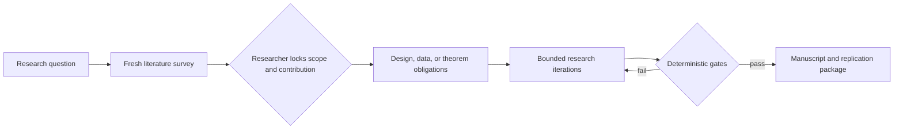

# Invisible Hands for Economists

An auditable economics-research skill that turns a research question into an evidence-backed empirical, theoretical, or structural manuscript. It uses tool-acquired literature and data, a provenance graph, design-specific validity checks, competing-mechanism tests, reproducible result bindings, and adversarial review. A failed hard gate returns the research process to the relevant stage instead of allowing unsupported prose.

## Research flow



Core guarantees:

- New and low-citation work remains eligible through separate frontier-search lanes.
- Model memory is not accepted as literature or data evidence.
- Quantitative claims require hash-bound data provenance and generated results.
- Identification and economic mechanisms are audited separately.
- Formal claims distinguish paper proofs, proof sketches, and Lean-verified theorems.
- Manuscript delivery requires complete section coverage, central-claim review, and rendered LaTeX inspection.

## Dream-RSI iteration

The optional Dream-RSI loop learns which action kinds most effectively resolve each failed research stage. It uses append-only discovery histories and deterministic package-gate progress as feedback. Coefficients, p-values, effect direction, and agreement with researcher intuition never enter the policy reward.

```bash
# Learn/update a stage-conditioned policy from prior trajectories
python3 scripts/dream_replay_simulator.py \
  --tree research/discovery_tree.jsonl \
  --policy-out research/dream-policy.json

# Run a bounded online loop through an explicit action adapter
python3 scripts/dream_replay_simulator.py --online \
  --tree research/discovery_tree.jsonl \
  --policy research/dream-policy.json \
  --actions research/dream-actions.json \
  --adapter scripts/research_action_adapter.py \
  --root . --config research/package.json \
  --max-steps 10 --max-cost 50
```

See [Dream-RSI research iteration](references/dream_rsi.md) for the action and adapter contracts. Online execution stops on package completion, budget exhaustion, a block, or a researcher checkpoint.

## Install

### Codex

```bash
codex plugin marketplace add Tohskcid/invisible-hands-for-economists --ref main
codex plugin add invisible-hands-for-economists@invisible-hands
```

### Claude Code

```bash
claude plugin marketplace add Tohskcid/invisible-hands-for-economists
claude plugin install invisible-hands-for-economists@invisible-hands
```

### Google Antigravity

```bash
agy plugin install https://github.com/Tohskcid/invisible-hands-for-economists
```

Direct skill installations remain supported:

```bash
git clone https://github.com/Tohskcid/invisible-hands-for-economists.git \
  "$HOME/.agents/skills/econ-research-lab"

git clone https://github.com/Tohskcid/invisible-hands-for-economists.git \
  "$HOME/.claude/skills/econ-research-lab"

git clone https://github.com/Tohskcid/invisible-hands-for-economists.git \
  "$HOME/.gemini/config/skills/econ-research-lab"
```

## Core tools

| Tool | Purpose |
|---|---|
| `search_literature.py` / `check_topic_survey.py` | Acquire current literature evidence and gate contribution claims |
| `check_data_provenance.py` | Verify source, license, schema, acquisition, and hashes |
| `check_design_audit.py` / `check_mechanism_audit.py` | Challenge identification and claimed channels |
| `validate_research_manifest.py` / `audit_claims.py` | Validate the provenance and argument graph |
| `check_result_bindings.py` | Bind manuscript numbers to generated results |
| `check_manuscript_coverage.py` / `check_logic_review.py` | Gate section completeness and central claims |
| `check_lean_proof.py` | Verify locked Lean statements, proof terms, and axioms |
| `check_latex.py` | Compile, inspect logs, render, and bind visual review |
| `check_project_layout.py` | Require paper artifacts to live in purpose-named folders |
| `check_research_package.py` | Run all applicable delivery gates and return failed iteration stages |
| `dream_replay_simulator.py` | Learn a safe research-action policy and run bounded online iterations |

## Verify

```bash
python3 -m unittest discover -s tests -q
python3 scripts/validate_library.py --json
uvx --from skills-ref agentskills validate "$(pwd)"
```

MIT Licensed.
