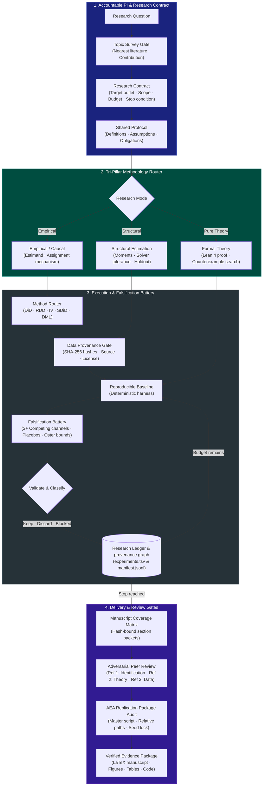

<div align="center">

# Invisible Hands for Economists

[](LICENSE)
[](SKILL.md)
[](SKILL.md)
[](references/lean_harness.md)
[](references/replication_audit.md)
[](references/team_protocol.md)
[](references/dream_rsi.md)

<br/>


<br/>

**An auditable, end-to-end Multi-Agent Research Lab for Empirical, Theoretical, and Structural Economics.**<br/>
<sub>One accountable PI coordinates bounded specialist agents, discovers and verifies data with cryptographic hashes, formalizes mathematical proofs with Lean 4, runs reproducible econometric pipelines, and stress-tests manuscripts via adversarial peer review.</sub>

<br/>

[Architecture](#-architecture) • [Trust Surface](#-trust-surface--audit-rigor) • [Core Capabilities](#-capabilities) • [Protocol Reference](#-protocol-index) • [Installation](#-install) • [CLI Tools](#-cli-tools)

</div>

---

## 🏛 Trust Surface & Audit Rigor

Unlike generic prompt catalogs, **Invisible Hands for Economists** enforces deterministic, cryptographic, and mathematical verification gates. AI generation is halted whenever a gate fails:

| Verification Lane | Standard / Technology | Gate Rule & Enforcement | Primary Reference |
|---|---|---|---|
| **Data Provenance Gate** | SHA-256 Hashes & Public/Enclave Check | Estimation is hard-blocked until data source, schema, license, and acquisition scripts match hashes. | [`data_acquisition.md`](references/data_acquisition.md) |
| **Methodology Router** | Identification Design Screen | Routes from the estimand and institutional assignment mechanism—never from significance or data shape. | [`method_router.md`](references/method_router.md) |
| **Database Wrangling** | Institutional Cleaning Conventions | Enforces standard rules for WRDS (CRSP/Compustat CCM), TEJ, CSMAR, CFPS, Census (IPUMS), FRED, PWT, EIA, EPA, and Patents. | [`database_cleaning_recipes.md`](references/database_cleaning_recipes.md) |
| **Modern Estimation** | Stata / R / Python Recipes | Prescribes heterogeneity-robust DiD (`csdid`, `sunab`, `did_imputation`), SDiD (`synthdid`), Bartik, bias-corrected RDD, and effective weak-IV tests. | [`estimation_recipes.md`](references/estimation_recipes.md) |
| **Text-as-Data Audit** | LLM Pinning & Reliability Standards | Enforces snapshot-pinned models, zero temperature, prompt hash freezes, and Cohen's $\kappa \ge 0.70$ on human gold samples. | [`text_as_data.md`](references/text_as_data.md) |
| **Falsification Battery** | Anti-Confirmation-Bias Refutations | Formulates 3+ competing mechanisms; tests temporal placebos, permutation swaps, density discontinuities, and Oster bounds. | [`falsification_battery.md`](references/falsification_battery.md) |
| **Formal Theory Proof** | Lean 4 + Mathlib Kernel Verification | Mathematical theorems are marked `formally proved` only when verified by the locked Lean 4 kernel with axiom allowlists. | [`lean_harness.md`](references/lean_harness.md) |
| **Structural Solver** | Fixed Moments & Solver Contraction | Monitors contraction mapping tolerances, holdout sample validation, and numerical stability bounds. | [`structural.md`](references/structural.md) |
| **Replication Audit** | AEA Data & Code Availability Policy | Verifies zero machine-specific absolute paths, deterministic seeds, raw data immutability, and single master script (`run_all.sh`). | [`replication_audit.md`](references/replication_audit.md) |
| **Adversarial Peer Review** | 3-Archetype Economics Referees | Pre-delivery multi-agent review simulating the Identification Policeman, Theory/Mechanism Critic, and Data Hygiene Nitpicker. | [`adversarial_referees.md`](references/adversarial_referees.md) |
| **Dream-RSI Discovery Simulator** | Exact Replay Simulator & Meta-Policy | Discovery history DAG is treated as an exact simulator, evaluating exploration/pruning policies at zero compute cost before online deployment. | [`dream_rsi.md`](references/dream_rsi.md) |

---

## 🧭 Architecture



---

## ⚡ Capabilities

- **Question-to-Paper Harness**: Starts from one sentence, runs baseline and citation-count-independent frontier searches, binds selected new papers into the manuscript, decomposes their field-changing move, and pauses for scope, contribution, design/data, and claim locks.
- **Tri-Pillar Economics Coverage**: Integrates reduced-form causal inference, formal microeconomic theory (with Lean 4 kernel verification), and dynamic structural estimation in a unified DAG.
- **Database Cleaning Recipes**: Eliminates institutional data traps in standard empirical databases:
  - **WRDS (CRSP & Compustat)**: CCM linkage (`linktype in ('LU', 'LC')`), negative prices (bid-ask midpoint), Fama-French June fiscal lags, and Davis-Fama-French Book Equity.
  - **Taiwan TEJ**: Price dividend adjustments, quarterly flow variable cumulative-to-single-quarter decomposition, and industry exclusions.
  - **China CSMAR**: Board filtering (ChiNext, STAR), ST/*ST and financial firm screening, reinvested dividend returns (`Dretwd`), and quarterly flow adjustments.
  - **Micro / Survey (CFPS & US Census/IPUMS)**: Immutable `pid` vs. dynamic `fid`, sampling weights (`pweight`/`PERWT`), 5-digit zero-padded County FIPS (`09001`), and boundary harmonization crosswalks.
  - **Macro (FRED & PWT 10.x)**: Flow/stock aggregation rules and living standards (`rgdpe`) vs. productive capacity/TFP (`rgdpo`) selection.
- **Modern Econometric Recipes**: Pre-configured code patterns for Stata, R, and Python covering Staggered DiD (`csdid`, `sunab`, `did_imputation`), bias-corrected RDD (`rdrobust`), Montiel Olea & Pflueger effective weak-IV tests, Conley spatial HAC, and Double Machine Learning (`DoubleML`).
- **Falsification & Competing Mechanisms Battery**: Rejects confirmation bias by formalizing 3+ alternative confounding stories, temporal placebos, donor swaps, and Oster selection bounds.
- **AEA-Grade Replication Audit**: Enforces American Economic Association Data and Code Availability policies: zero absolute paths, pinned seeds, immutable raw data checksums, and single-click master execution.
- **Pre-Submission Adversarial Peer Review**: Simulates three classic referee archetypes (Identification Policeman, Theory/Mechanism Critic, and Data Hygiene Nitpicker) to stresstest manuscripts before submission.

---

## 📚 Protocol Index

| Area | Reference File | Focus |
|---|---|---|
| **Core Protocol** | [`references/research_protocol.md`](references/research_protocol.md) | Single accountable PI rules, state machine, and ledger logging |
| **Breakthrough Anatomy** | [`references/breakthrough_anatomy.md`](references/breakthrough_anatomy.md) | Research-question, bottleneck, core-move, credibility, generativity, and boundary rubric |
| **Empirical Mode** | [`references/empirical.md`](references/empirical.md) | Reduced-form causal inference, panel FE, and validity checks |
| **Method Router** | [`references/method_router.md`](references/method_router.md) | Identification screen (DiD, IV, RDD, SDiD, DML, selection) |
| **Estimation Code** | [`references/estimation_recipes.md`](references/estimation_recipes.md) | Stata/R/Python modern syntax and AER/QJE three-line tables |
| **Database Recipes** | [`references/database_cleaning_recipes.md`](references/database_cleaning_recipes.md) | Cleaning WRDS, TEJ, CSMAR, CFPS, Census/IPUMS, FRED, PWT |
| **Falsification Battery** | [`references/falsification_battery.md`](references/falsification_battery.md) | Competing mechanisms matrix, temporal/unit placebos, Oster bounds |
| **Theory Mode** | [`references/theory.md`](references/theory.md) | Pure theory proofs, counterexamples, and formalization plans |
| **Lean 4 Verification** | [`references/lean_harness.md`](references/lean_harness.md) | Formal mathematical verification using Lean 4 + Mathlib |
| **Structural Mode** | [`references/structural.md`](references/structural.md) | Dynamic discrete choice, BLP random coefficients, and solvers |
| **Real-World Relevance** | [`references/real_world_relevance.md`](references/real_world_relevance.md) | Decision applicability, transportability, feasibility, and monitoring |
| **Text-as-Data** | [`references/text_as_data.md`](references/text_as_data.md) | LLM annotation, prompt determinism, inter-coder reliability ($\kappa \ge 0.70$) |
| **Replication Audit** | [`references/replication_audit.md`](references/replication_audit.md) | AEA Data & Code Availability replication package checklist |
| **Adversarial Referees** | [`references/adversarial_referees.md`](references/adversarial_referees.md) | 3-Archetype economics referee stress tests and report generator |
| **Manuscript Workflow** | [`references/manuscript.md`](references/manuscript.md) | Evidence-driven scale, section packets, and logic reviews |
| **Dream-RSI Discovery** | [`references/dream_rsi.md`](references/dream_rsi.md) | Exact discovery tree replay simulator and offline policy dreaming |

---

## 🌌 Dream-RSI: Recursive Self-Improvement through Evolving Worlds

Based on *Dream-RSI: Recursive Self-Improvement through Evolving Worlds* (Google DeepMind / UMD / UVA 2026; [dream-rsi.com](https://www.dream-rsi.com/)), the lab converts accumulated research history into an **exact replay simulator**:
- **History as an Exact Simulator**: Every econometric specification trial, first-stage diagnostic, and proof branch is persisted into `research/discovery_tree.jsonl`.
- **Zero-Compute Offline Dreaming**: Candidate exploration and pruning policies are evaluated by replaying historical discovery trees at zero execution cost, screening thousands of specification curve configurations in milliseconds.
- **Evolving World Pool**: Each completed research run adds another world to the simulator pool, transferring evolved meta-policies and adversarial referee memories to accelerate future research projects.

Run the Dream-RSI offline simulator:
```bash
# Audit historical discovery tree integrity
python3 scripts/dream_replay_simulator.py --tree research/discovery_tree.jsonl --audit

# Dream offline specification curve across history at zero execution cost
python3 scripts/dream_replay_simulator.py --tree research/discovery_tree.jsonl --dream
```

---

## 📦 Install

The same release is packaged for Codex, Claude Code, and Google Antigravity. The plugin manifests are thin adapters around one shared `econ-research-lab` skill.

### Codex

[Codex plugins](https://developers.openai.com/zh-Hant/plugins/build/plugins) can be installed from this repository's marketplace:

```bash
codex plugin marketplace add Tohskcid/invisible-hands-for-economists --ref main
codex plugin add invisible-hands-for-economists@invisible-hands

# Refresh the marketplace and installed plugin later
codex plugin marketplace upgrade invisible-hands
codex plugin add invisible-hands-for-economists@invisible-hands
```

### Claude Code

[Claude Code plugins](https://code.claude.com/docs/en/plugin-marketplaces) use the compatible marketplace in the same repository:

```bash
claude plugin marketplace add Tohskcid/invisible-hands-for-economists
claude plugin install invisible-hands-for-economists@invisible-hands

# Refresh the marketplace and installed plugin later
claude plugin marketplace update invisible-hands
claude plugin update invisible-hands-for-economists@invisible-hands
```

### Google Antigravity

[Antigravity CLI](https://codelabs.developers.google.com/sdd-agy-cli) can import the shared Agent Skill directly from GitHub:

```bash
agy plugin install https://github.com/Tohskcid/invisible-hands-for-economists
agy plugin list
```

Direct `git clone` skill installs remain supported for existing users. Pull with `git pull --ff-only` to update those installations.

<details>
<summary>Direct skill installation paths</summary>

```bash
# Codex global skill
git clone https://github.com/Tohskcid/invisible-hands-for-economists.git \
  "$HOME/.agents/skills/econ-research-lab"

# Claude Code global skill
git clone https://github.com/Tohskcid/invisible-hands-for-economists.git \
  "$HOME/.claude/skills/econ-research-lab"

# Antigravity global skill
git clone https://github.com/Tohskcid/invisible-hands-for-economists.git \
  "$HOME/.gemini/config/skills/econ-research-lab"
```

</details>

---

## 🛠 CLI Tools

| Tool | Purpose |
|---|---|
| `econ_data_profiler.py` | Panel keys, missingness, balance, descriptive bins, LaTeX/SVG output |
| `check_data_provenance.py` | Verify source, license, acquisition, schema, and file hashes for real, restricted, or proxy data |
| `check_literature_archive.py` | Check bibliography coverage, lawful access records, PDF signatures, names, and hashes |
| `check_manuscript_coverage.py` | Bind every manuscript section and claim to code, results, exhibits, diagnostics, and appendices |
| `check_topic_survey.py` | Validate nearest-work coverage and the pre-design contribution decision |
| `search_literature.py` | Query current Crossref metadata and preserve raw response hashes as tool-use evidence |
| `search_library.py` | Retrieve candidate result cards without loading the entire library |
| `check_lean_proof.py` | Lock theorem statements and audit Lean proof terms and axioms |
| `validate_research_manifest.py` / `audit_claims.py` | Validate provenance, proxy scope, argument DAGs, and manuscript markers |
| `check_result_bindings.py` | Bind displayed manuscript numbers and a results-file hash to structured estimates |
| `check_design_audit.py` | Enforce diagnostics selected for the declared empirical design |
| `check_structural_audit.py` | Enforce convergence, identification, holdout, and counterfactual diagnostics |
| `check_real_world_audit.py` | Block real-world recommendations without applicability evidence |
| `check_text_audit.py` | Validate LLM text-as-data annotation, inter-coder reliability, zero temperature, and prompt hashes |
| `check_research_package.py` | Run applicable manifest, manuscript, result, empirical/structural audit, and LaTeX gates for CI |
| `check_latex.py` | Compile safely, inspect logs, render every page, and bind visual review to the PDF hash |
| `check_logic_review.py` | Bind a central-claim referee report to manuscript and manifest hashes |
| `run_research_team.py` | Validate and run a bounded provider-neutral specialist task DAG |
| `run_dgp_evals.py` / `run_skill_evals.py` | External-agent regression and deterministic design checks |

---

## 🛡 Verification & Standards

```bash
# Validate library cards and journal database
python3 scripts/validate_library.py --json

# Run package unit tests
python3 -m unittest discover -s tests -v

# Validate agent skills specification
uvx --from skills-ref agentskills validate "$(pwd)"
```

MIT Licensed. Maintained by [Tohskcid](https://github.com/Tohskcid).
